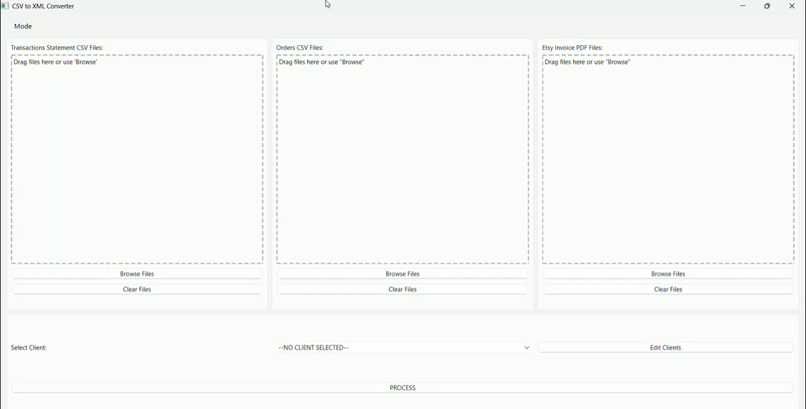
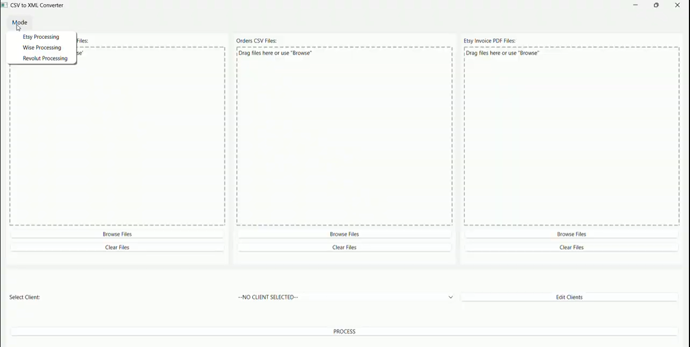
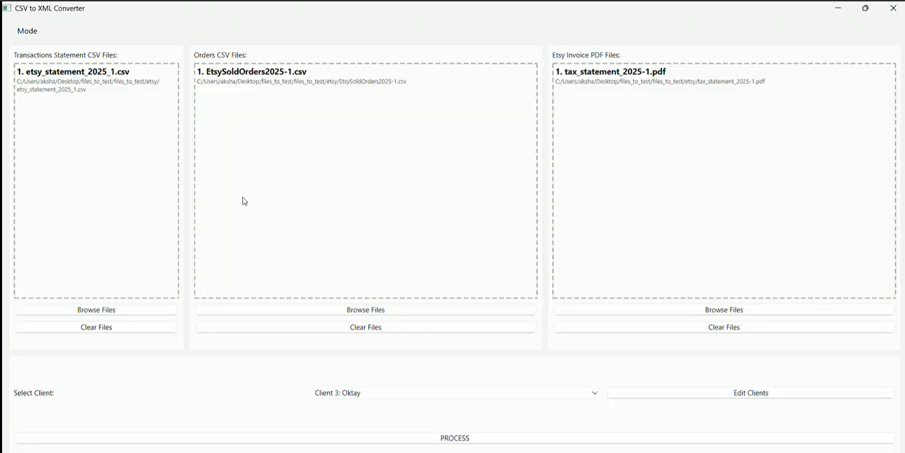
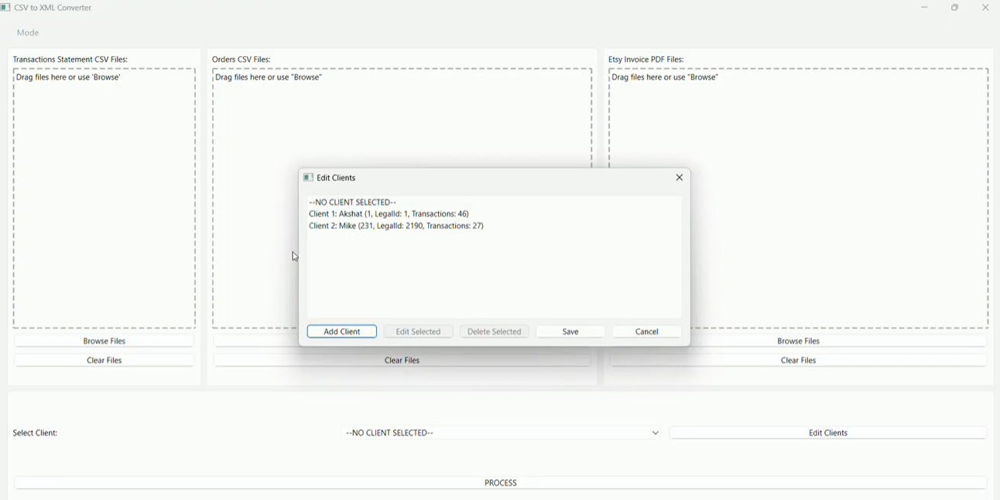
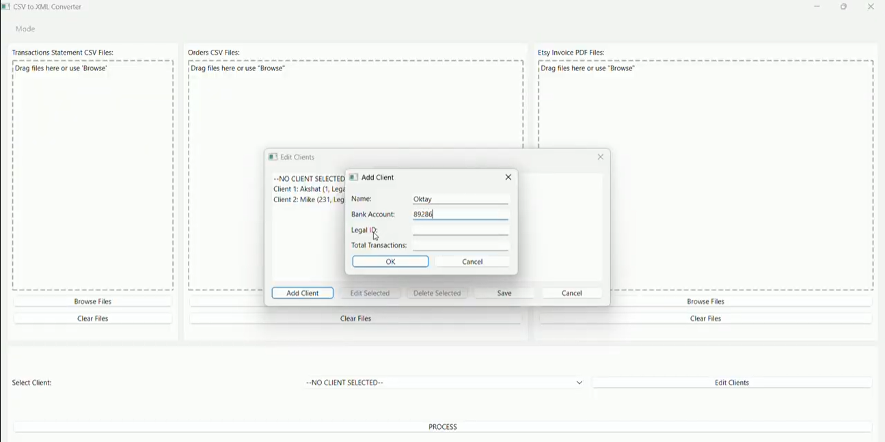
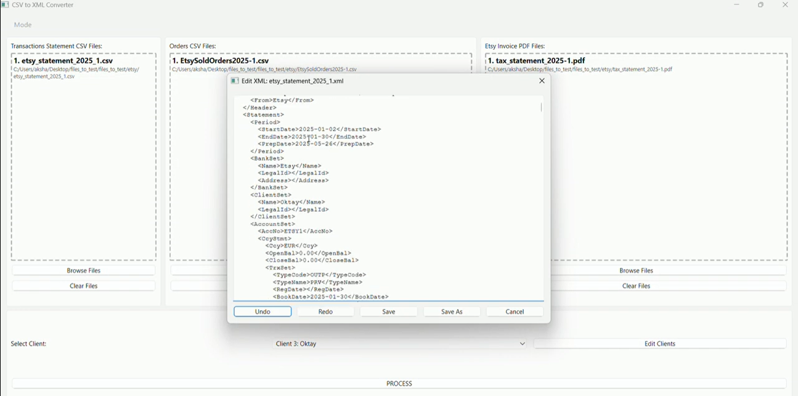

# FiDAViSta-Converter

A software solution designed to assist accountants in converting financial data (transactions, statements, etc.) from CSV or PDF files into FiDAViSta-compliant XML format. This tool automates the conversion process with fast processing times and an intuitive graphical user interface (GUI) for easy navigation.

## Project Resources

- **Presentation Slides & Report**: Available in [CE/project_docs](CE/project_docs)
- **Video Presentation**: [Watch on YouTube](https://youtu.be/WOEphRbgGpM)
- **Installation ZIP File**: [Download from Google Drive](https://drive.google.com/drive/folders/1Gr9aJNLn6cMid96FxTSMfDdl657A-bNd?usp=sharing)
- **Documentation**: [Google Docs](https://docs.google.com/document/d/1-BgFL-_NS9lkY4evLRGx8olBv16lrraJ9kKTxE3TRkA/edit?usp=sharing)

## Software Overview

This software streamlines the conversion of financial data into the FiDAViSta XML format, reducing manual effort for accountants. Key features include:

- **Fast Processing**: Quickly converts CSV and PDF files into XML.
- **User-Friendly GUI**: Intuitive interface for selecting modes, uploading files, and managing clients.
- **Multiple Modes**: Supports Etsy, Revolut, and Wise transaction processing.

## Screenshots

### Main Interface

### Mode Selection

### File Input

### Client Management

### Generated XML Output

## System Requirements

To run the software, ensure your system meets the following requirements:

- **Operating System**: Windows 10 or above
- **Input Files**: CSV files (e.g., bank statements, payments, taxes, fees) and PDF files (e.g., Etsy invoices)
- **Output**: FiDAViSta-compliant XML files
- **Disk Space**: Minimum 500 MB
- **RAM**: Minimum 2 GB

## Installation

Follow these steps to install and set up the software on your Windows system:

1. **Download the ZIP File**:
   - Open a web browser (e.g., Google Chrome).
   - Navigate to the [Google Drive download link](https://drive.google.com/drive/folders/1Gr9aJNLn6cMid96FxTSMfDdl657A-bNd?usp=sharing).
   - Sign in to your Google account if prompted.
   - Locate the software ZIP file in the folder.
   - Click **Download** and save the file to a non-system directory (e.g., Desktop or Documents, **not** C:\).

2. **Extract the Software**:
   - Open File Explorer and navigate to the downloaded ZIP file.
   - Right-click the file and select **Extract All** (or use a tool like 7-Zip or WinRAR).
   - Choose a destination folder in a non-system directory (e.g., Desktop or Documents, **not** C:\).
   - Click **Extract** to unzip the files. Ensure all files are extracted successfully.

3. **Run the Application**:
   - Navigate to the extracted folder.
   - Double-click `CSVtoXMLConverter.exe` to launch the software.

## How to Use the Software

1. **Launch the Application**: Open `CSVtoXMLConverter.exe`.
2. **Select a Mode**: Choose from Etsy, Revolut, or Wise via the **Mode** menu (Etsy is the default).
3. **Upload Files**: Use the **Browse Files** button to upload required CSV or PDF files for the selected mode.
4. **Select a Client**: Choose a client from the dropdown menu or add a new one via **Edit Clients**.
5. **Process Files**: Click the **PROCESS** button to convert the files to FiDAViSta XML format.
6. **Edit and Save**: After processing, click **EDIT** to modify the XML, then choose **SAVE** or **SAVE AS** to finalize.

## User Interface Overview

The GUI is designed for ease of use, with three main modes:

- **Etsy Mode**: Requires Transaction CSV, Orders CSV, and Invoice PDFs.
- **Revolut Mode**: Requires Transaction CSV.
- **Wise Mode**: Requires Transaction CSV.

Each mode includes:

- **File Upload Sections**: For Transactions, Orders, or Invoices, with **Browse Files** and **Clear Files** buttons.
- **Client Selection**: A dropdown menu at the bottom to select or manage clients.
- **Process Button**: Initiates the conversion process.

## Converting to FiDAViSta XML

To generate FiDAViSta-compliant XML files:

1. Select the desired mode from the **Mode** menu.
2. Upload the required files for the chosen mode:
   - **Etsy**: Transaction CSV, Orders CSV, and Invoice PDFs.
   - **Revolut**: Transaction CSV.
   - **Wise**: Transaction CSV.
3. Select a client profile from the dropdown.
4. Click **PROCESS** to generate the XML file.
5. Use the **EDIT** button to review or modify the XML, then **SAVE** or **SAVE AS** to store the output.

## Client Management

Manage client profiles by clicking **Edit Clients**:

- **Add**: Create new client profiles with name, bank account, legal ID, and transaction count.
- **Edit**: Update existing client information.
- **Delete**: Remove outdated or unnecessary profiles.

**Note**: The default client ("--NO CLIENT SELECTED--") cannot be edited or deleted.

## Supported Modes

| Mode        | Required Files                            | Description                                              |
| ----------- | ----------------------------------------- | -------------------------------------------------------- |
| **Etsy**    | Transaction CSV, Orders CSV, Invoice PDFs | Processes Etsy transaction and order data with invoices. |
| **Revolut** | Transaction CSV                           | Converts Revolut bank statement data.                    |
| **Wise**    | Transaction CSV                           | Converts Wise transaction data.                          |

## Troubleshooting

- **Administrator Permissions**: If prompted for admin rights, ensure the software is installed in a non-protected directory (e.g., Desktop).
- **File Not Found**: Verify that all required CSV/PDF files are uploaded for the selected mode.
- **Crashes**: Check the console logs (run with console enabled) and report issues with steps to reproduce.

## Client Feedback

> "I finally got it tested and I am impressed about the speed
> and simplicity. Great work!"
> — Client, SIA PayBaltic

## Contributions

This project was developed by a dedicated team with the following contributions:

- **Moulik Arora**: Backend Lead (Core logic, XML generation, data parsing pipeline)
- **Cong Minh Tran**: Project Manager
- **Aman Pathak**: Frontend Developer
- **Akshat Dhingra**: Backend Developer Assistant
- **Anas Mehmood**: Documentation
- **Hemant**: Logic Developer
- **Rakesh Gudimetla**: Testing
